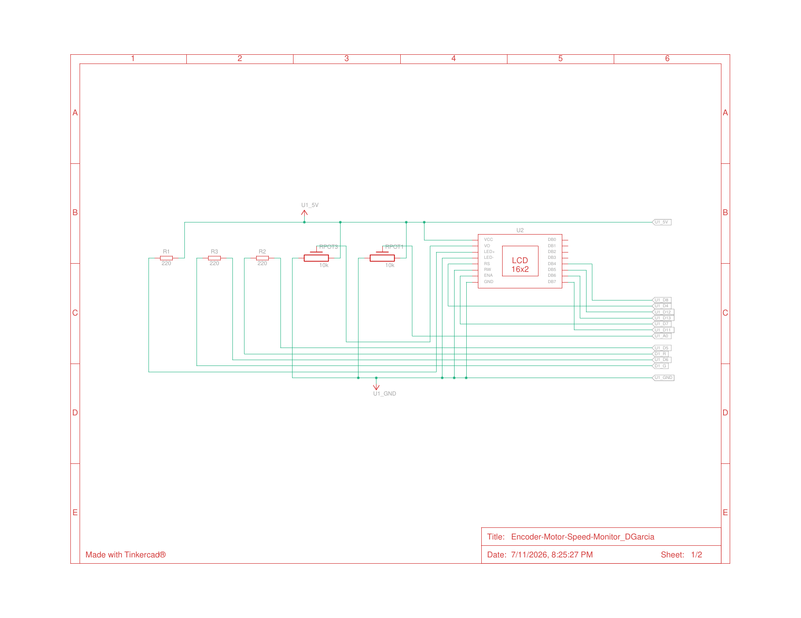
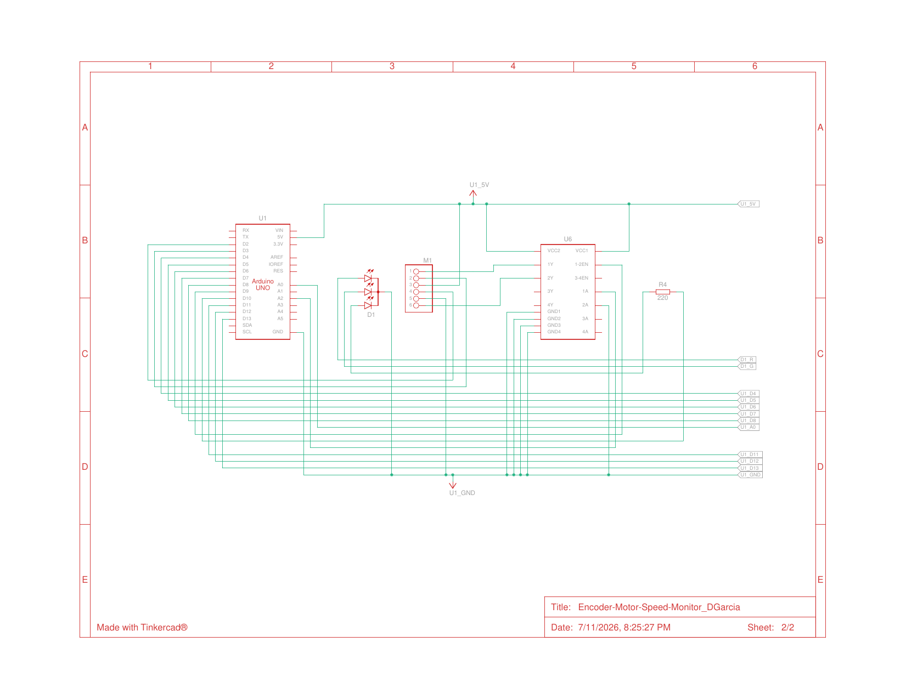

# Encoder-Based Motor Speed Monitor

A DC motor driven through an L293D with a quadrature encoder read by hardware interrupt — live RPM computed every 500 ms and reported on an LCD with RGB speed-band feedback.

**Course:** RBT173 Lab 5.1 · **Tools:** Arduino (C++), L293D, quadrature encoder

**Demo:** [Watch on YouTube](https://youtu.be/nIbhPxZkv6A) · **Circuit:** [View simulation on Tinkercad](https://www.tinkercad.com/things/7ldN3cFKRSH-encoder-motor-speed-monitordgarcia?sharecode=zz6Yiv0b_nBAVakK_5kzi-FR0fuKtDHJjS4SW2TDl2Q)

## Degree Objective

**Objective 3 — Develop mechanical control systems by implementing transducers, actuators, feedback, vision and sensing systems, and other mechanical systems into robotic platforms.**

**How it meets the objective:** It implements the feedback half of motor control — a quadrature encoder (transducer) measures what the motor (actuator) is actually doing, computing live RPM independent of the commanded speed.

## How It Works

A potentiometer throttle sets PWM duty on the L293D enable pin. Channel A edges are counted two ways: an ISR on every edge (CHANGE = 2x count rate) plus a polled edge counter in `loop()` as a backup. Every 500 ms the loop snapshots both counters — the ISR count inside a `noInterrupts()` critical section — takes whichever saw more edges, and converts edges to RPM using a calibrated counts-per-revolution. The LCD shows live A/B logic levels on line one and RPM with PWM% on line two; an RGB LED maps speed to color bands.

## Engineering Highlights

- **Diagnosed a simulator limitation and engineered around it:** Tinkercad stops delivering the D2 external interrupt while the parallel LCD is active, silently killing the ISR count. The fix counts edges redundantly (ISR + polling) and trusts whichever counter captured more in the window — on real hardware both counters simply agree.
- **Calibrated measurement:** CPR derived empirically against Tinkercad's motor readout (~698 edges/0.5 s at 184 RPM → CPR ≈ 455), with the recalibration procedure documented in the source.
- **Correct ISR discipline:** `volatile` counter, minimal ISR body, and an atomic read-and-reset window — the standard pattern for interrupt-driven measurement.
- **Overflow-aware math:** RPM computed with unsigned-long arithmetic (`pulses * 120UL / CPR`) to avoid silent 16-bit overflow.

## Schematic

Sheet 1 — display and controls: 16x2 LCD with contrast pot, throttle pot, and current-limit resistors.

Sheet 2 — drive and feedback: Arduino Uno, L293D H-bridge, DC motor with quadrature encoder, and RGB status LED.

## Files

- `encoder_rpm_monitor.ino` — full commented source
- `encoder-motor-monitor_schematic_p1.png` / `_p2.png` — circuit schematic (Tinkercad, 2 sheets)

## Links

- Demo video: https://youtu.be/nIbhPxZkv6A
- Tinkercad simulation: [Encoder Motor Speed Monitor](https://www.tinkercad.com/things/7ldN3cFKRSH-encoder-motor-speed-monitordgarcia?sharecode=zz6Yiv0b_nBAVakK_5kzi-FR0fuKtDHJjS4SW2TDl2Q)
- Portfolio: https://www.garciarobotics.com/
